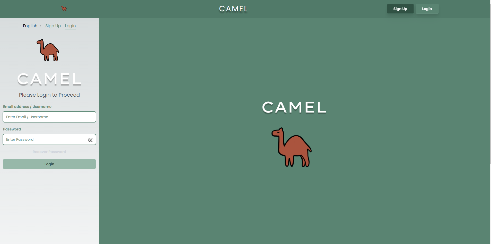
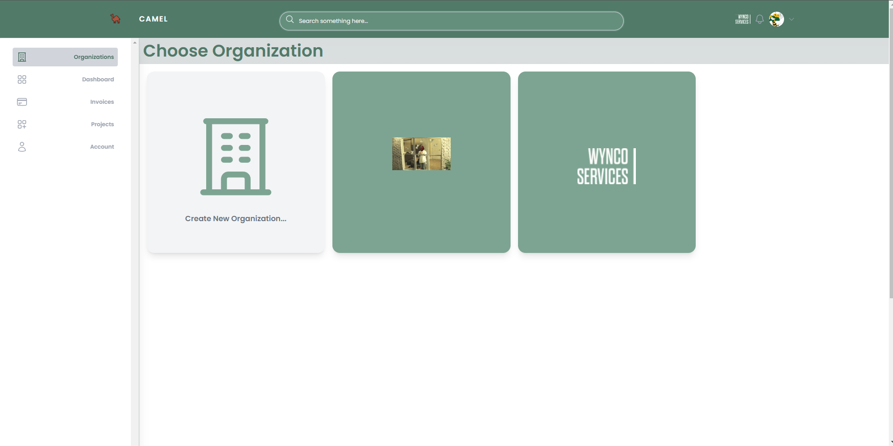

<a name="readme-top"></a>

<!-- # SacOverflow -->

[![NextJS Icon][nextjs-icon]](https://nextjs.org/)
[![Contributors][contributors-shield]][contributors-url]
[![Forks][forks-shield]][forks-url]
[![Stargazers][stars-shield]][stars-url]
[![Issues][issues-shield]][issues-url]
[![MIT License][license-shield]][license-url]

<!-- PROJECT LOGO -->
<br />
<div align="center">

  <h3 align="center">SacOverflow</h3>
  <h2 align="center">Cloud Asset Management Enhanced Launcher</h2>
  <div align="center">
          
</div>

  <p align="center"> 
Welcome to Sacoverflow's GitHub! 🚀 This project is aimed at assisting Project Managers in overviewing their organization's finances and overall management about projects and tasks within their organization.
<br>
<a href="https://github.com/SacOverflow/CAMEL-Services/issues">Request Feature</a>
<a href="https://github.com/SacOverflow/CAMEL-Services/issues">Report Bug</a>
·

  </p>
</div>

<!-- TABLE OF CONTENTS -->
<details>
  <summary>Table of Contents</summary>
  <ol>
    <li>
      <a href="#about-the-project">About The Project</a>
      <ul>
        <li><a href="#built-with">Built With</a></li>
      </ul>
    </li>
    <li>
    <a href="features">Application Features</a>
    </li>
    <li>
      <a href="#getting-started">Getting Started</a>
      <ul>
        <li><a href="#prerequisites">Prerequisites</a></li>
        <li><a href="#Setup">Setup</a></li>
        <li><a href="#installation">Installation</a></li>
        <li><a href="#testing">Testing</a></li>
      </ul>
    </li>
    <li><a href="#contributing">Contributing</a></li>
    <li><a href="#license">License</a></li>
    <li><a href="#acknowledgments">Acknowledgments</a></li>
    <li><a href="#team members">Team Members</a></li>
    <li><a href="#coursework">Coursework</a>
    <ul> 
      <li><a href="#csc-190">CSC 190</a></li>
      <li><a href="#csc-191">CSC 191</a></li>
    </ul>
</li>
  </ol>
</details>

## About the Project

The SacOverflow development team, consisting of Computer Science undergraduates from California State University, Sacramento, is behind this project.

This project is aimed at assisting Project Managers in managing their team and projects. By making use of this software, supervisors or relevant stakeholders will be allowed to make more informed decisions within their organization and simplify their day-to-day task duties. This software is to be developed with the intention of being used on both mobile and web-based platforms.

The application was designed to provide our Client (Joseph Luong) with a platform that would allow him to manage his organization's finances and projects. The application will allow him to view the financial status of his organization, view the status of his projects, and manage his team members.

<p align="right">(<a href="#readme-top">back to top</a>)</p>

### Features

-   User Authentication (Login/Sign Up)
-   Business Dashboard (Overview of finances and projects)
-   Project Dashboard (Overview of project details and tasks)
-   Project progression updates
-   Notification system
-   User profile settings
-   User roles and permissions
-   Multi-Language Support
-   Mobile and Web Responsive Design
-   [Continuous Integration](https://github.com/SacOverflow/CAMEL-Services/actions/workflows/unit-tests.yml?query=branch%3Amain) and [Continuous Deployment](https://github.com/SacOverflow/CAMEL-Services/deployments/Production) (CI/CD) Pipeline

<p align="right">(<a href="#readme-top">back to top</a>)</p>

### Built With

-   [![NextJS Icon][nextjs-icon]](https://nextjs.org/)
-   [![ReactJS Icon][react-icon]](https://react.dev/)
-   [![TypeScript Icon][typescript-icon]](https://www.typescriptlang.org/)
-   [![TailwindCSS Icon][tailwind-icon]](https://tailwindcss.com/)
-   [![SupaBase Icon][supabase-icon]](https://supabase.com/)
-   [![PostgreSQL Icon][postgres-icon]](https://www.postgresql.org/)
-   [![Vercel Icon][vercel-icon]](https://vercel.com/)

<p align="right">(<a href="#readme-top">back to top</a>)</p>

## Database Schemas


## Getting Started

### Prerequisites

-   [![NodeJS Icon][nodejs-icon]](https://nodejs.org/en/)
-   [![NPM Icon][npm-icon]](https://www.npmjs.com/)

### Setup

1. Create a `.env.local` file in the root directory of the project.
2. Add the following to the `.env.local` file.

```bash
NEXT_PUBLIC_SUPABASE_URL=YOUR_URL_API_KEY
NEXT_PUBLIC_SUPABASE_ANON_KEY=YOUR_ANON_PUBLIC_API_KEY
SUPABASE_SERVICE_KEY=YOUR_SUPABASE_SERVICE_KEY
```

Please refer to your [API Settings](https://supabase.com/dashboard/project/_/settings/api) page in your Supabase Dashboard. Here you can find your `URL`, `anon`, and `service_role` keys.

### Installation

1. Clone the repository to your local machine and change directories into it. Stable builds will be based off the main branch.

```bash
git clone https://github.com/SacOverflow/CAMEL-Services.git
cd SacOverflow
```

2. Install the dependencies using your preferred package manager.

```bash
npm install
# or
yarn install
# or
pnpm install
# or
bun install
```

3. Run the development server.

```bash
npm run dev
# or
yarn dev
# or
pnpm dev
# or
bun dev
```

Open [http://localhost:3000](http://localhost:3000) with your browser to see the result.

<p align="right">(<a href="#readme-top">back to top</a>)</p>

## Testing

Ensure that your development environment meets the system requirements follow the setup instructions below to run tests effectively.

### Test Environment Setup

#### System Requirements

-   **NextJS Version:** 13.5.6
-   **SupaBase Version:** ^2.39.7
-   **TypeScript Version:** ^5.4.2
-   **Tailwind Version:** ^3
-   **Node Version:** 20.2.3
-   **React Version:** ^18
-   **Jest Version:** ^29.7.0

### Setup Instructions

1. Clone the GitHub repository:

    ```bash
    git clone https://github.com/SacOverflow/CAMEL-Services

    ```

2. Switch to the testing branch:

    ```bash
    git checkout Tests

    ```

3. Create a `.test.env` file in the root directory. Ensure to include your own API keys in these files.

#### Environment Variables for Testing

Populate the `test.env` file with the following environment variables. These are crucial for accessing various services and are secrets, so ensure they are never shared:

```bash
         DOTENV_CONFIG_PATH=./test.env
         VALID_USER={PLACEHOLDER}
         VALID_PASSWORD={PLACEHOLDER}
         TESTING_USER_ID={PLACEHOLDER}
         ORG_ID={PLACEHOLDER}
         PROJECT_ID={PLACEHOLDER}
         NEXT_PUBLIC_SUPABASE_URL={DASHBOARD_VALUE}
         NEXT_PUBLIC_SUPABASE_ANON_KEY={DASHBOARD_VALUE}
         SUPABASE_SERVICE_KEY={DASHBOARD_VALUE}
```

> [!WARNING]
> Note: These files contain API keys and other sensitive information and should not be shared on GitHub.

4. Install all required packages:
    ```bash
    npm i
    ```
5. To run all tests, execute:

    ```bash
    npm run test

    ```

6. To run specific tests, use:
    ```bash
    npm run test -- -t "Test title"
    ```

### Test Results

To view the test results, navigate to the `coverage` folder in the root directory. Open the `index.html` file in your browser to view the test coverage results.

To view the test suit outcome results, navigate to the `testReports` folder in the root directory. Open the `testReportsUpdate.html` file in your browser to view the test results.

<p align="right">(<a href="#readme-top">back to top</a>)</p>

## Contributing

Pull requests are welcome. For major changes, please open an issue first to discuss what you would like to change.

Please make sure to update tests as appropriate.

<p align="right">(<a href="#readme-top">back to top</a>)</p>

## License

[MIT][license-url]

<!-- ACKNOWLEDGMENTS -->

## Acknowledgments

-   [Choose an Open Source License](https://choosealicense.com)
-   [Img Shields](https://shields.io)
-   [Best-README-Template](https://github.com/othneildrew/Best-README-Template)
<p align="right">(<a href="#readme-top">back to top</a>)</p>

### Learn More

This project uses [`next/font`](https://nextjs.org/docs/basic-features/font-optimization) to automatically optimize and load Inter, a custom Google Font.

To learn more about Next.js, take a look at the following resources:

-   [Next.js Documentation](https://nextjs.org/docs) - learn about Next.js features and API.
-   [Learn Next.js](https://nextjs.org/learn) - an interactive Next.js tutorial.

You can check out [the Next.js GitHub repository](https://github.com/vercel/next.js/) - your feedback and contributions are welcome!

# Team Members

Meet the team behind SacOverflow, a diverse group of talented Computer Science undergraduates from California State University, Sacramento. Each member brings unique skills and perspectives to our project, dedicated to enhancing project management through our Cloud Asset Management Enhanced Launcher.

-   **Fernando Mendoza Junior** - Lead Developer | [GitHub](https://github.com/jvniorrr)
-   **Miguel Lopez** - Developer | [GitHub](https://github.com/Miguel1357)
-   **Jacob Correa** - Developer | [GitHub](https://github.com/RealHoltz)
-   **Joseph Doan** - Developer | [GitHub](https://github.com/JDoan03)
-   **Kiran Kaur** - Developer | [GitHub](https://github.com/KiranKaur3)
-   **Imren More** - Developer | [GitHub](https://github.com/imrenmore)
-   **Dakota Conn** - Developer | [GitHub](https://github.com/DGConn)
-   **Hashem Jaber** - Developer | [GitHub](https://github.com/hashemJaber)

Each member is committed to delivering a high-quality product that helps project managers efficiently oversee their projects, tasks, and financials.

<p align="right">(<a href="#readme-top">back to top</a>)</p>

## Screenshots

#### Home Page


The homepage offers insights into the various aspects of Camel Services, including testimonials, features, and site functionalities.

#### Login



This is the sign up page where users can sign in and create a user account. The user either needs to input current account information to sign in or they need to select 'Sign Up' to create an account. 

#### Sign Up


In order for a user to create an account to login, they will first need to sign up in the sign up page. The user needs to type in the following information to create an account:

1. First Name
2. Last Name
3. Email Address
4. Username
5. Password
6. Confirm Password

After all of the required information is properly typed in, the user can then click on the button at the bottom to confirm and create their account.

#### Password Reset


A user can reset their password by entering their email in the password reset page. Once the email is confirmed by pressing the button at the bottom, the email will be sent. This email will contain a link to another page of the application that will allow the user to update their own password.

#### Password Update


In the password update page, the user will be able to update their password after clicking on the link that they emailed to themselves from the password reset page. The user will need to put in two passwords that match to confirm the password they want to have. Passwords would also need at least one uppercase letter and one number. The password must also be 6 or more characters long.

#### Organization Page



The organization page lets users select their specific business or organization and includes role-based access management to ensure that only members with the appropriate privileges have elevated access to their business details.

# Coursework

## CSC 190

#### Sprint 2


###### Mockups Design

-   <h5>Home Page</h5>
      <p align='center'>
          
      </p>
-   <h5>Login Page<h5/>
      <p align='center'>
          
      </p>
-   <h5>Sign Up Page<h5/>
      <p align='center'>
          
      </p>
-   <h5>Dashboard Page<h5/>
      <p align='center'>
          
      </p>
-   <h5>Projects Dashboard Page<h5/>
      <p align='center'>
          
      </p>
-   <h5>Projects Details Dashboard Page<h5/>
      <p align='center'>
          
      </p>

<br/>
<br/>

#### Sprint 3


#### Sprint 4


#### Sprint 5


## CSC 191

#### Sprint 6


#### Sprint 7


#### Sprint 8


#### Sprint 9


#### Sprint 10


## Deploy on Vercel

The easiest way to deploy your Next.js app is to use the [Vercel Platform](https://vercel.com/new?utm_medium=default-template&filter=next.js&utm_source=create-next-app&utm_campaign=create-next-app-readme) from the creators of Next.js.

Check out our [Next.js deployment documentation](https://nextjs.org/docs/deployment) for more details.

<!-- MARKDOWN LINKS & IMAGES -->
<!-- https://www.markdownguide.org/basic-syntax/#reference-style-links -->

[MIT-shield]: https://img.shields.io/badge/license-MIT-blue.svg
[contributors-shield]: https://img.shields.io/github/contributors/hashemJaber/SacOverflow.svg?style=for-the-badge
[contributors-url]: https://github.com/hashemJaber/SacOverflow/graphs/contributors
[forks-shield]: https://img.shields.io/github/forks/hashemJaber/SacOverflow.svg?style=for-the-badge
[forks-url]: https://github.com/hashemJaber/SacOverflow/network/members
[stars-shield]: https://img.shields.io/github/stars/hashemJaber/SacOverflow.svg?style=for-the-badge
[stars-url]: https://github.com/hashemJaber/SacOverflow/stargazers
[issues-shield]: https://img.shields.io/github/issues/hashemJaber/SacOverflow.svg?style=for-the-badge
[issues-url]: https://github.com/hashemJaber/SacOverflow/issues
[license-shield]: https://img.shields.io/github/license/hashemJaber/SacOverflow.svg?style=for-the-badge
[license-url]: https://github.com/hashemJaber/SacOverflow/LICENSE.txt
[nextjs-icon]: https://img.shields.io/badge/next.js-000000?style=for-the-badge&logo=nextdotjs&logoColor=white
[react-icon]: https://img.shields.io/badge/React-20232A?style=for-the-badge&logo=react&logoColor=61DAFB
[typescript-icon]: https://img.shields.io/badge/TypeScript-007ACC?style=for-the-badge&logo=typescript&logoColor=white
[tailwind-icon]: https://img.shields.io/badge/Tailwind_CSS-38B2AC?style=for-the-badge&logo=tailwind-css&logoColor=white
[supabase-icon]: https://img.shields.io/badge/Supabase-181818?style=for-the-badge&logo=supabase&logoColor=white
[postgres-icon]: https://img.shields.io/badge/PostgreSQL-316192?style=for-the-badge&logo=postgresql&logoColor=white
[vercel-icon]: https://img.shields.io/badge/Vercel-000000?style=for-the-badge&logo=vercel&logoColor=white
[nodejs-icon]: https://img.shields.io/badge/Node.js-43853D?style=for-the-badge&logo=node.js&logoColor=white
[nodejs-url]: https://nodejs.org/en/
[bun-icon]: https://img.shields.io/badge/Bun-%23000000.svg?style=for-the-badge&logo=bun&logoColor=white
[npm-icon]: https://img.shields.io/badge/NPM-%23CB3837.svg?style=for-the-badge&logo=npm&logoColor=white
